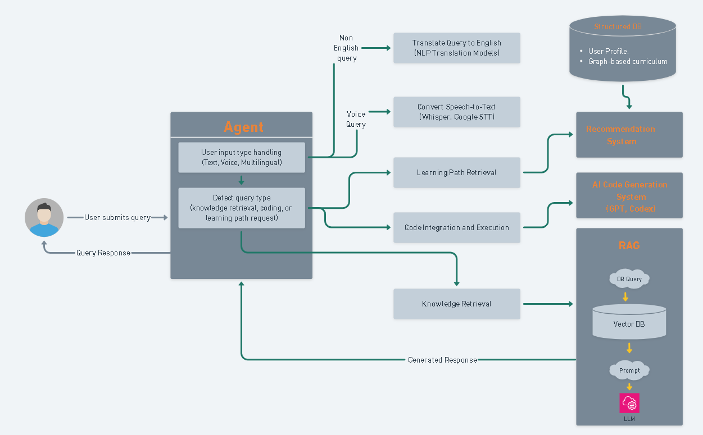

# Cognitive Bot

## 🚀 AI Tutor - Knowledge Retrieval & Coding Assistance
Cognitive Bot is an AI-powered learning assistant that provides structured learning paths, voice-enabled interactions, hands-on coding exercises, and personalized study plans. This project is built to help users explore AI concepts through a **Retrieval-Augmented Generation (RAG) system** and **AI-based coding assistance**.
### System Design 




## 🌟 Features Overview
### ✅ **MVP** - Core AI Learning Platform
The MVP focuses on **Knowledge Retrieval & Coding Assistance**.
- **Knowledge Retrieval (RAG System)**
  - Retrieves AI learning resources from research papers, textbooks, and online courses.
  - Uses **FAISS/Pinecone/ChromaDB** for vector search.
  - **LLM-powered answers** with GPT-4 / LLaMA / Mistral.
  - **LangChain-powered RetrievalQA** for accurate response generation.
- **AI Coding Assistance**
  - Fetches and generates **Python code** for AI/ML concepts.
  - Uses **OpenAI Codex / Code Llama** for generating code snippets.
  - Runs AI code in **Google Colab / Jupyter Notebook API**.
- **Web Interface**
  - Interactive UI built with **GARDO**.
  - Users can input queries and receive text-based responses & executable code.
- **Query Routing (Intent Classification)**
  - Identifies whether a query is knowledge-based or code-related.
  - Uses **Rule-based (MVP)**, **Zero-shot Classification (Phase 1)**, and **Fine-tuned BERT Model (Scaling phase)**.

### 🔥 **Phase 1** - Multilingual & Voice-Enabled Learning
Expanding AI Tutor to **Multilingual & Voice-Based Interactions** and **Personalized AI Learning Paths**.
- **Multilingual Support**
  - AI-powered translation for content, queries, and responses.
  - Speech-to-text (Whisper, Google STT) for voice-based queries.
  - Text-to-Speech tutor (Google TTS, ElevenLabs) for spoken responses.
- **Curriculum Mapping & Adaptive Learning**
  - Structured AI learning modules (CNNs, Transformers, RL, etc.).
  - Personalized study paths using AI-driven recommendations.
- **Interactive Code Execution & AI Learning Environment**
  - Real-time coding exercises with Google Colab/Jupyter integration.
  - Hands-on AI model experimentation.

### 🎮 **Phase 2** - AI Gamification & Community Learning
Enhancing Cognitive Bot with **Gamification, Community Collaboration, and Multimodal Learning**.
- **AI Gamification**
  - Badges, leaderboards, daily challenges.
  - AI-powered trivia games.
- **Community & Peer Collaboration**
  - Discussion forums, mentorship programs.
  - Group AI projects & peer feedback.
- **Multimodal AI Learning**
  - Video tutorials, interactive AI diagrams.
  - Speech-to-speech learning mode for enhanced engagement.

## 🔧 Tech Stack
| Feature                 | Recommended Tools / Models |
|-------------------------|-------------------------|
| **Vector Database**     | FAISS / Pinecone / ChromaDB |
| **Embedding Model**     | Sentence Transformers (all-MiniLM-L6-v2) |
| **LLM for Answering**   | GPT-4, LLaMA 2, Mistral |
| **Code Generation**     | OpenAI Codex / Code Llama |
| **Code Execution**      | Google Colab API / Jupyter API |
| **Intent Detection**    | Rule-Based (MVP) / LangChain Classifier / Zero-Shot Classifier (Phase 1) |
| **Web UI**              | Streamlit / Chatbot UI (React) |
| **Backend API**         | FastAPI / Flask |

## 🛠 Getting Started
### **1️⃣ Clone the Repository**
```bash
git clone https://github.com/ishi3012/cognitive_bot.git
cd Cognitive_bot
```
### **2️⃣ Install Dependencies**
```bash
python -m venv venv
source venv/bin/activate  
pip install -r requirements.txt
```
### **3️⃣ Run the API Server**
```bash
uvicorn backend.main:app --host 0.0.0.0 --port 8000
```
### **4️⃣ Start the Web UI (GARDO)**
```bash
gardo start frontend/app.py
```

## 🚀 Next Steps
- Implement API endpoints for **RAG-based retrieval & code execution**.
- Improve **multilingual AI capabilities**.
- Integrate **voice-based AI tutoring**.

## 🤝 Contributing
Contributions are welcome! Please submit a pull request or open an issue for any suggestions or bug reports.

## 📜 License
This project is licensed under the MIT License. See the [LICENSE](LICENSE) file for details.

## 📬 Contact
Feel free to reach out for questions or collaborations:

Email: shilpa.musale02@gmail.com  
GitHub: [Shilpa Musale](https://github.com/ishi3012)

**Stay tuned for future updates!** 🚀

